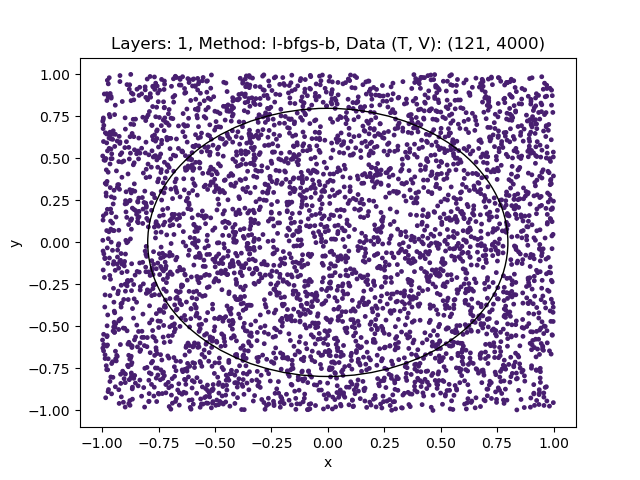
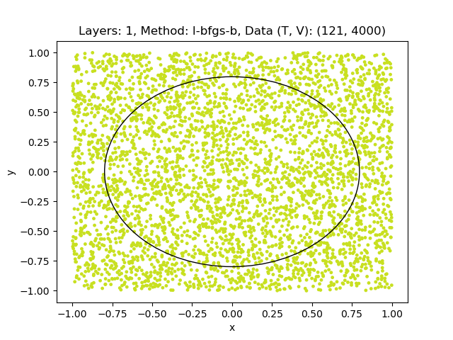

# Data-Re-Uploading

Implementing the Quanvolutional NN described in [arXiv:1907.02085](https://arxiv.org/abs/1907.02085) with [Qibo](https://qibo.science/).

Implemented:

1. Circle geometry;
2. Tricrown geometry;

Missing implementations:

1. Weighted loss function;
2. Other geometries;

## Circle geometry

The universal quantum classifier, as proposed in the aforementioned paper, is tested by determining whether a point lies inside or outside a circle with a radius of sqrt(pi/2).

As shown in the following images (on the left the prediction before training and on the right after training) it improves its classification accuracy as the number of layers grow:

    
    

